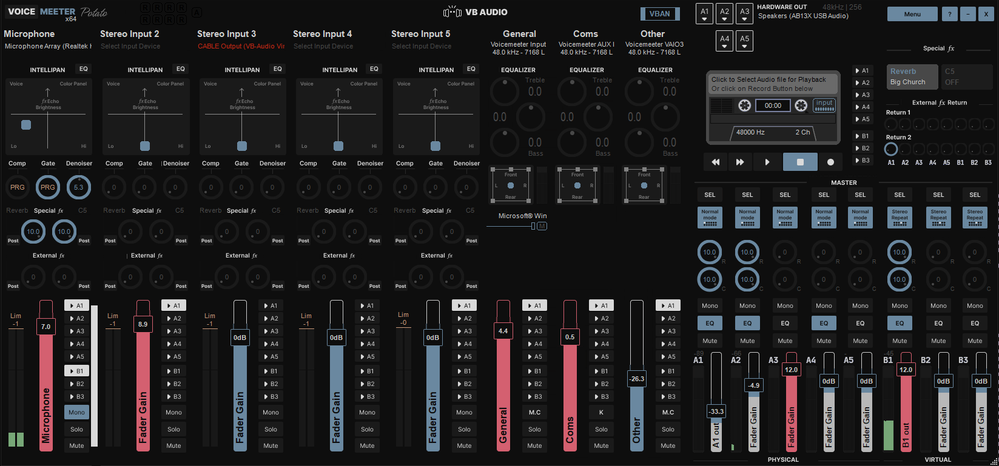

# AMOLED Soft for Voicemeeter

<p align="center">
  
</p>

A minimal, dark AMOLED theme for Voicemeeter Potato with soft matte backgrounds and muted steel accents. Designed to be easy on the eyes with a clean, borderless look.

Forked from [Catppuccin Mocha for Voicemeeter](https://github.com/emkaix/voicemeeter-theme-catppuccin-mocha).

---

## Usage

This theme is meant to be used with the [VoiceMeeter Chroma](https://github.com/emkaix/voicemeeter-chroma) mod.

1. Copy the `themes/amoled_soft` folder to `C:\Users\<USER>\Documents\Voicemeeter\themes\`
2. Set the theme in `vmchroma.yaml`:

```yaml
theme:
  potato: amoled_soft
```

3. Launch Voicemeeter with Chroma mod.

## Palette

| Role      | Color         | Hex       |
|-----------|---------------|-----------|
| Base      | Matte black   | `#0E0E0E` |
| Surface   | Dark gray     | `#282828` |
| Surface   | Mid gray      | `#484848` |
| Overlay   | Soft gray     | `#6A6A6A` |
| Text      | Soft white    | `#CCCCCC` |
| Accent    | Muted steel   | `#6A88A0` |
| Red       | Muted coral   | `#D46070` |
| Outline   | Light neutral | `#B8B8B8` |
| Green     | Muted green   | `#78A878` |
| Blue      | Soft blue     | `#6888B8` |

## Customizing the BMPs

The `.bmp` files are the background images Voicemeeter draws its UI on top of. You can edit them in any image editor to create your own look.

A Figma template is available if you want a quick starting point:

<p align="center">
  <a href="https://www.figma.com/community/file/1656845961678418451">
    
  </a>
</p>

The template contains editable layers for the background panels — just tweak what you want and export.

### Exporting from Figma

1. Select the frame.
2. Go to **File > Export** or press `Ctrl+Shift+E`
3. Set format to **PNG** and export
4. Open the exported PNG in **Paint.NET**
> [!TIP]
> Paint.NET is free and available at [getpaint.net](https://getpaint.net). Any editor that can save 24-bit BMP will work.

5. Go to **File > Save As** and select **BMP**
6. In the configuration pop-up, select **24-bit**
7. Save with the same filename as the original `.bmp`
8. Copy the file into the theme folder and restart Voicemeeter

